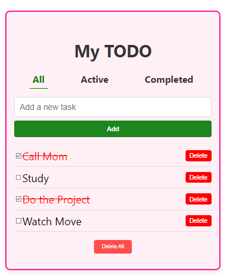
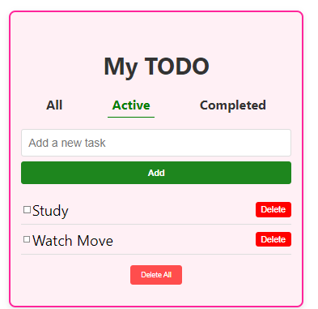
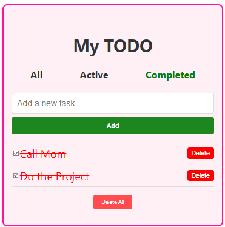

# To Do List

This project is a simple To-Do List application built using React, `localStorage`, and the `useContext` hook. The application allows users to manage tasks with the ability to filter by "All", "Active", and "Completed" tasks.

## Project Structure

The project consists of the following parts:

1. **Navbar**: Navigation between the "All", "Active", and "Completed" tasks.
2. **Task List**: Displays tasks based on the selected tab (All, Active, or Completed).
3. **TextField & Add Button**: A single input component that allows users to add new tasks to the list.

### NavBar

The navbar contains three tabs for filtering tasks:

- **All**: Shows all tasks (both active and completed).
- **Active**: Shows only tasks that are not completed.
- **Completed**: Shows only tasks that are completed.

#### Navigation Tabs UI:
The UI allows switching between tabs, and tasks will be filtered according to the selected tab.

### TextField and Add Button

The textfield component and the Add button are present in all three tabs.

- **TextField**: The user can input a new task here.
- **Add Button**: When clicked, if the textfield is empty, an error message will be displayed. If a task is entered, it will be added to the list.

### Task Management Logic

- **Adding a Task**: When the Add button is clicked, the app adds a task object to the `todoList` array stored in `localStorage`. The task object includes:
  - A random `taskId` (numeric string).
  - The `taskName` (name of the task).
  - A `completed` flag (boolean).
  - A `createdAt` date (timestamp when the task is created).
  
- **Task Filtering**: The app displays tasks based on the selected filter (All, Active, or Completed). Each tab will show the relevant tasks accordingly.

### Task UI Example:

Each task will be displayed with its name, and there will be a checkbox for the user to mark it as completed.

### Completed Task UI:

Completed tasks will have a different style to visually distinguish them from active tasks.

### Requirements

- Use React Context API with `useContext` to manage the state of the to-do list.
- Store the to-do list in `localStorage` to persist it even after the browser is closed.
- Implement error handling for adding tasks when the input field is empty.
## Preview of the Project 

### All Task

### Active Task

### Completed Task

